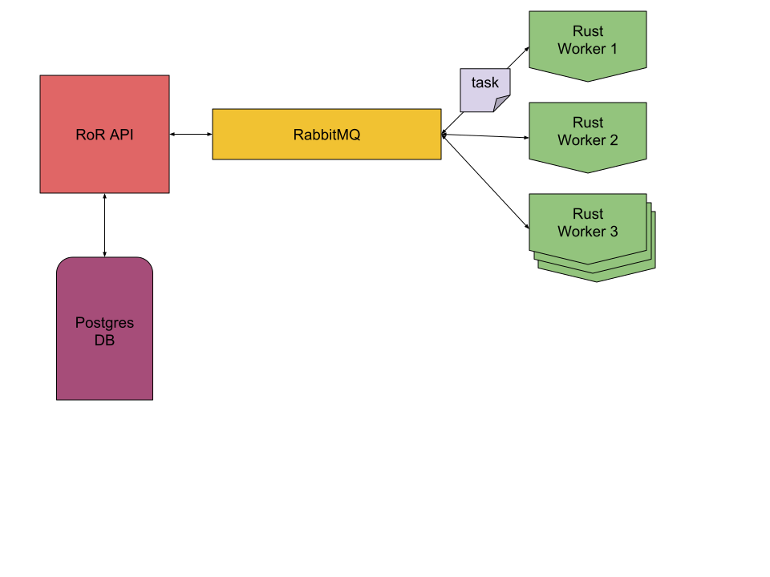

# Prime-time

## Basic setup

run services:    
`docker-compose up`

create db:    
`docker-compose run api bin/bundle exec rake db:create`

migrate db:    
`docker-compose run api bin/bundle exec rake db:migrate`

scale workers:    
`docker-compose up --scale worker=3`

## Requests

create task:    
`curl -XPOST -H "Accept: application/json" -H "Content-type: application/json" -d '{"task":{"number": 20308732902 }}' localhost/tasks/`

get all tasks:    
`curl -XGET localhost/tasks/`

get a task by **id**:    
`curl -XGET localhost/tasks/:id`

## Explanation

### Architecture

### States of a task

**pending**: the task is waiting for a free worker   
**working**: a worker is computing the task    
**done**: the task is ended, the result is in the `result` attribute    
